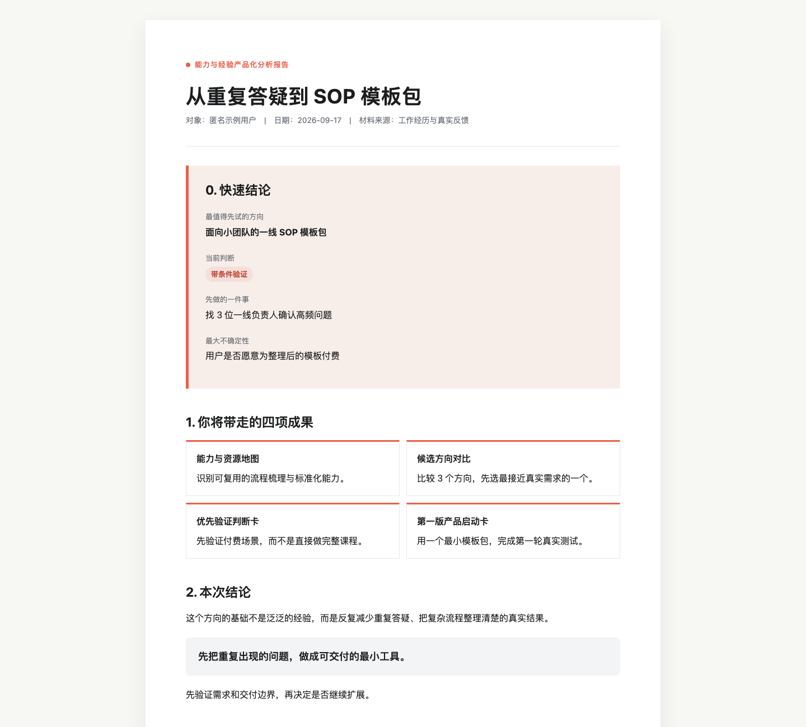

# 能力与经验产品化 Skill

> **把你的经验和技能，做成自己的第一个小产品。**

## 仓库项目

- **能力与经验产品化 Skill**：当前页面介绍的产品化工具。
- **[低内耗社交指南 V1.0](low-friction-social-guide/)**：67 个真实社交场景，包含网页检索、连续阅读、PDF、场景练习和配套 Skill。

很多人做过不少事，也经常被人请教，却很难回答：我到底能靠什么开始？

这个 Skill 不会把零散经历硬包装成专家课程。它会从你的真实经历、顺手能力和用户问题出发，先找到 2-3 个可以尝试的方向，再验证哪一个值得做，最后整理出第一版可开始测试的小产品。

## 你会拿到什么

1. **能力与资源地图**：看清已经验证过的经验、隐藏能力线索与可用资源。
2. **候选方向对比**：明确 2-3 个可能的产品方向，知道它们分别服务谁、解决什么。
3. **优先验证判断卡**：识别最大风险与最危险假设，决定先验证什么。
4. **第一版产品启动卡**：写清卖什么、最小交付、第一批找谁，以及 7 天行动计划。

最终会生成一份可保存的《能力与经验产品化分析报告》：包含 Markdown 版和 HTML 版。

## 适合谁

- 做过工作、项目、副业或长期兴趣，但不知道能整理成什么产品的人。
- 想做小产品、自由职业或副业，但不想一开始就录课、建群、投入很多钱的人。
- 有一个想法，却不确定它是不是真需求、值不值得继续做的人。

## 它不做什么

- 不承诺收入、销量或市场成功。
- 不替你凭空制造经历，也不把所有人包装成专家。
- 不跳过市场验证，直接让你做一门大课或搭复杂社群。

## 关于本仓库

这里是公开介绍页，只包含产品说明、效果示意和更新记录。

完整 Skill、参考文件和 HTML 母版不在本仓库公开。获取与更新方式以正式购买页面的说明为准。

查看 [更新记录](CHANGELOG.md)。

---

© 未白实验室出品
